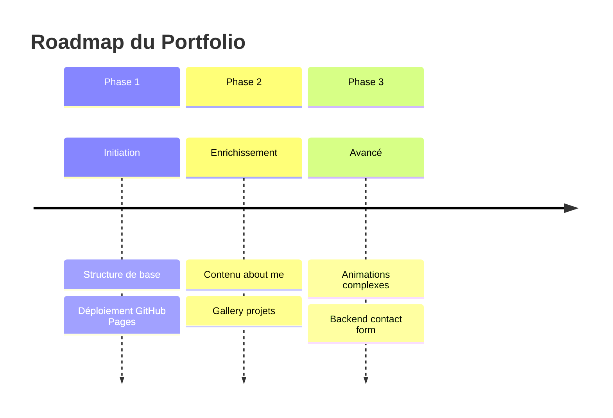
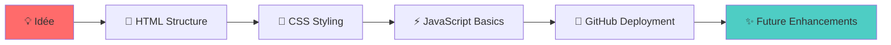

# **🎨 README.md Créatif pour Ton Portfolio**

Voici plusieurs options créatives pour ton README.md :

## **🎯 OPTION 1 : Minimaliste & Élégant**
```markdown
# 🎨 Mon Portfolio


> *"Le voyage de mille kilomètres commence par un premier commit."*

## 🌟 À Propos
Mon premier site portfolio déployé sur GitHub Pages.  
Un projet simple mais significatif qui marque le début de mon parcours en développement web.

## 🚀 Caractéristiques
- ✅ Design responsive et moderne
- ✅ Structure HTML sémantique
- ✅ Animations CSS subtiles
- ✅ Déploiement continu via GitHub Pages
- 🚧 Section projets interactive *(en cours)*
- 🚧 Mode sombre/clair *(à venir)*

## 🛠️ Stack Technique
```yaml
Frontend:
  - HTML5: Structure sémantique
  - CSS3: Flexbox, Grid, Animations
  - JavaScript: Interactivité basique
  
Outils:
  - Git & GitHub: Version control
  - VS Code: Éditeur
  - GitHub Pages: Hébergement
```

## 📂 Structure du Projet
```
monportfolio/
├── 📄 index.html      # Point d'entrée
├── 🎨 style.css       # Styles principaux
├── ⚡ script.js       # Logique JavaScript
├── 📖 README.md       # Cette documentation
└── 📁 assets/         # Ressources statiques
    ├── 🖼️ images/
    └── 🎯 icons/
```

## 🎨 Design Philosophy
```css
/* Minimaliste mais expressif */
.philosophy {
  principle: "Less is more";
  focus: "User experience";
  colors: "Monochromatic with accent";
  typography: "Clean & readable";
}
```

## 🚀 Déploiement
Le site est automatiquement déployé via **GitHub Pages** :
🔗 **[Visiter le Site](https://Hichaminventor10.github.io/monportfolio/)**

## 📈 Évolution du Projet


## 🧪 Pour Commencer
```bash
# Clone le projet
git clone https://github.com/Hichaminventor10/monportfolio.git

# Ouvre dans VS Code
cd monportfolio && code .

# Ouvre dans le navigateur
open index.html  # Mac
start index.html # Windows
```

## 🤝 Contribuer
Les contributions sont les bienvenues ! Voici comment :

1. **Fork** le projet
2. **Crée une branche** (`git checkout -b feature/AmazingFeature`)
3. **Commit** tes changements (`git commit -m 'Add AmazingFeature'`)
4. **Push** sur la branche (`git push origin feature/AmazingFeature`)
5. **Ouvre une Pull Request**

## 📚 Apprentissage
Ce projet représente mon approche d'apprentissage :
> **"Step by step, commit by commit"**  
> Chaque ligne de code est une étape dans mon parcours d'étudiant en Software Engineering.

## 📄 License
Distribué sous licence MIT. Voir `LICENSE` pour plus d'informations.

## 🌱 À Propos de Moi
```javascript
const developer = {
  name: "Hicham",
  status: "Software Engineering Student",
  learningApproach: "Step by step",
  currentFocus: "Web Development Fundamentals",
  nextGoal: "React & Backend Integration",
  
  quote() {
    return "Patience in learning, passion in building.";
  }
};
```

---
*⭐ Si ce projet t'inspire, n'hésite pas à laisser une star !*
```

## **🌈 OPTION 2 : Avec Badges Animés**
```markdown
<div align="center">

# ✨ Portfolio Personnalisé


[](https://visitorbadge.io/status?path=Hichaminventor10/monportfolio)


</div>

## 📖 **Histoire du Projet**
> *"Every great developer once started where you are now."*  
> Ce portfolio est le chapitre 1 de mon voyage en développement web.  
> Un projet simple mais symbolique qui représente mes premiers pas dans l'univers du code.

## 🎯 **Objectifs**
| Étape | Statut | Description |
|-------|--------|-------------|
| 🎨 Design | ✅ Complet | Interface clean et responsive |
| 📱 Mobile | ✅ Complet | Adapté à tous les écrans |
| 🚀 Déploiement | ✅ Complet | Hébergé sur GitHub Pages |
| ✨ Animations | 🚧 En cours | Interactions utilisateur |
| 📊 Projets | 📅 Planifié | Gallery interactive |

## 🚀 **Démo Live**
<p align="center">
  <a href="https://Hichaminventor10.github.io/monportfolio/">
    
  </a>
</p>

## 🛠️ **Installation Rapide**
```bash
# 1. Clone le projet
git clone https://github.com/Hichaminventor10/monportfolio.git

# 2. Navigue vers le dossier
cd monportfolio

# 3. Ouvre dans ton éditeur préféré
code .  # VS Code
# ou
open index.html  # Navigateur
```

## 📊 **Statistiques du Repo**
```text
📁 Structure:    4 fichiers principaux
🎨 Styles:      CSS moderne avec Flexbox/Grid
⚡ Interactivité: JavaScript vanilla
📱 Responsive:  100% mobile-friendly
🚀 Déploiement: GitHub Pages automatique
```

## 🌈 **Évolution**


## 🤝 **Rejoins l'Aventure**
<p align="center">
  <i>Ce projet est ouvert aux suggestions et améliorations !</i><br>
  <sub>Tu as une idée ? Ouvre une issue ou soumets une PR !</sub>
</p>

## 📚 **Citation d'Inspiration**
> *"The only way to learn a new programming language is by writing programs in it."*  
> ― Dennis Ritchie

---

<div align="center">
  
**🌟 Si ce projet t'inspire dans ton propre apprentissage, laisse une star !**  
*Chaque star est un encouragement sur ce chemin d'apprentissage pas à pas.*
  
[](https://github.com/Hichaminventor10)

</div>
```

## **📝 OPTION 3 : Pour Étudiant en Software Engineering**
```markdown
# 🎓 Portfolio d'Étudiant en Software Engineering

> *"Learning to code is like learning a language - it takes time, practice, and patience."*

## 👋 Salut, je suis Hicham !
**Étudiant en Software Engineering | Apprenant pas à pas**

Ce portfolio représente mon approche d'apprentissage :
- 🐢 **Slow & Steady** : Je prends le temps de comprendre les concepts
- 🧱 **Foundation First** : Je construis des bases solides
- 🚀 **Future-Oriented** : Je prépare mon futur en développement

## 🎯 Ce que ce projet démontre
| Compétence | Niveau | Description |
|------------|--------|-------------|
| HTML/CSS | 🌱 Débutant | Structure et stylisation de base |
| Git/GitHub | 🌱 Débutant | Contrôle de version et collaboration |
| Déploiement | 🌱 Débutant | Hébergement web avec GitHub Pages |
| Résolution de problèmes | 🌱 Débutant | Debugging et recherche de solutions |

## 📚 Mon Parcours d'Apprentissage
```
Semaine 1: HTML Fundamentals
Semaine 2: CSS Basics & Responsive Design
Semaine 3: JavaScript Introduction
Semaine 4: Git & GitHub Mastery
Semaine 5: Portfolio Project
→ FUTURE: React, Node.js, Databases...
```

## 🛠️ Comment j'ai construit ce projet
1. **Planification** : Sketch sur papier des sections
2. **Implémentation** : Code HTML structurel
3. **Stylisation** : CSS pour le design
4. **Interactivité** : JavaScript basique
5. **Déploiement** : GitHub Pages configuration
6. **Documentation** : Ce README détaillé

## 🌱 Philosophie d'Apprentissage
```javascript
const learningPhilosophy = {
  approach: "Step by step",
  priority: "Understanding over memorizing",
  mindset: "Growth mindset",
  practice: "Build projects to learn",
  
  dailyRoutine() {
    return [
      "Code for at least 1 hour",
      "Read documentation",
      "Solve one coding challenge",
      "Review previous concepts"
    ];
  }
};
```

## 🔗 Liens Utiles
- 🌐 [Site Live](https://Hichaminventor10.github.io/monportfolio/)
- 💻 [Code Source](https://github.com/Hichaminventor10/monportfolio)
- 📚 [Mes Notes d'Apprentissage](#) *(à venir)*

## 🤔 Pourquoi ce projet est important
1. **Preuve de compétence** : Montre ce que j'ai appris
2. **Base pour l'avenir** : Évoluera avec mes compétences
3. **Portefeuille professionnel** : Première pierre de mon portfolio
4. **Journal d'apprentissage** : Documente ma progression

## 📈 Prochaines Étapes
- [ ] Ajouter une section "About Me" détaillée
- [ ] Implémenter un mode sombre/clair
- [ ] Créer une gallery de projets
- [ ] Ajouter un formulaire de contact
- [ ] Optimiser les performances

## 💬 Citation qui m'inspire
> *"It's not that I'm so smart, it's just that I stay with problems longer."*  
> ― Albert Einstein

---

**💡 Conseil pour mes collègues étudiants :**  
*N'ayez pas peur de commencer petit. Chaque expert était un jour débutant.  
L'important n'est pas la vitesse, mais la constance dans l'apprentissage.*

---
*Développé avec ❤️ par un étudiant en Software Engineering qui croit au pouvoir de l'apprentissage progressif.*
```

## **🚀 COMMENT METTRE À JOUR TON README :**

```bash
# 1. Ouvre ton README.md dans VS Code
code README.md

# 2. Copie-colle l'option que tu préfères
# 3. Sauvegarde

# 4. Commit les changements
git add README.md
git commit -m "Updated README with creative description"

# 5. Push vers GitHub
git push
```

**Choisis l'option qui te correspond le plus !**  
- **Option 1** : Professionnel avec badges
- **Option 2** : Visuel avec animations
- **Option 3** : Focus étudiant & apprentissage

**Je peux t'aider à personnaliser encore plus si tu veux !** 🎨
