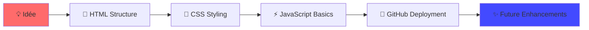

# 🎨 Mon Portfolio


> *"Le voyage de mille kilomètres commence par un premier commit."*

## 🌟 À Propos
Mon premier site portfolio déployé sur GitHub Pages.  
Un projet simple mais significatif qui marque le début de mon parcours en développement web.

## 🚀 Caractéristiques
- ✅ Design responsive et moderne
- ✅ Structure HTML sémantique
- ✅ Animations CSS subtiles
- ✅ Déploiement continu via GitHub Pages
- 🚧 Section projets interactive *(en cours)*
- 🚧 Mode sombre/clair *(à venir)*

## 🛠️ Stack Technique
```yaml
Frontend:
  - HTML5: Structure sémantique
  - CSS3: Flexbox, Grid, Animations
  - JavaScript: Interactivité basique
  
Outils:
  - Git & GitHub: Version control
  - VS Code: Éditeur
  - GitHub Pages: Hébergement
```

## 📂 Structure du Projet
```
monportfolio/
├── 📄 index.html      # Point d'entrée
├── 🎨 style.css       # Styles principaux
├── ⚡ script.js       # Logique JavaScript
├── 📖 README.md       # Cette documentation
└── 📁 assets/         # Ressources statiques
    ├── 🖼️ images/
    └── 🎯 icons/
```


## 📚 Apprentissage
Ce projet représente mon approche d'apprentissage :
> **"Step by step, commit by commit"**  


## 🌱 À Propos de Moi
```javascript
const developer = {
  name: "Hicham Kaber",
  status: "Software Engineering Student At ENSAH",

 
  
 
};
```


 
> Ce portfolio est le chapitre 1 de mon voyage en développement web.  
> Un projet simple mais symbolique qui représente mes premiers pas dans l'univers du code.


## 📊 **Statistiques du Repo**
```text
📁 Structure:    4 fichiers principaux
🎨 Styles:      CSS moderne avec Flexbox/Grid
⚡ Interactivité: JavaScript vanilla
📱 Responsive:  100% mobile-friendly
🚀 Déploiement: GitHub Pages automatique
```

## 🌈 **Évolution**


## 🤝 **Rejoins l'Aventure**
<p align="center">
  <i>Ce projet est ouvert aux suggestions et améliorations !</i><br>
  <sub>Tu as une idée ? Ouvre une issue ou soumets une PR !</sub>
</p>


<div align="center">
  
**🌟 Si ce projet t'inspire dans ton propre apprentissage, laisse une star !**  

  
[](https://github.com/Hichaminventor10)

</div>


## 🎯 Ce que ce projet démontre
| Compétence | Niveau | Description |
|------------|--------|-------------|
| HTML/CSS | 🌱 Débutant | Structure et stylisation de base |
| Git/GitHub | 🌱 Débutant | Contrôle de version et collaboration |
| Déploiement | 🌱 Débutant | Hébergement web avec GitHub Pages |
| Résolution de problèmes | 🌱 Débutant | Debugging et recherche de solutions |


## 🛠️ Comment j'ai construit ce projet
1. **Planification** : Sketch sur papier des sections
2. **Implémentation** : Code HTML structurel
3. **Stylisation** : CSS pour le design
4. **Interactivité** : JavaScript basique
5. **Déploiement** : GitHub Pages configuration
6. **Documentation** : Ce README détaillé


## 🤔 Pourquoi ce projet est important
1. **Preuve de compétence** : Montre ce que j'ai appris
2. **Base pour l'avenir** : Évoluera avec mes compétences
3. **Portefeuille professionnel** : Première pierre de mon portfolio


## 📈 Prochaines Étapes

- [ ] Implémenter un mode sombre/clair

- [ ] Ajouter un formulaire de contact

- [ ] Optimiser les performances


---

 
L'important n'est pas la vitesse, mais la constance dans l'apprentissage.❤️*

---
*Développé avec ❤️ par un étudiant en Software Engineering qui croit au pouvoir de l'apprentissage progressif.*
```


